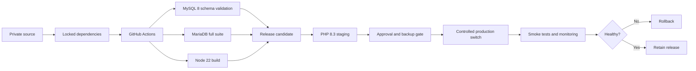

# Architecture and Risk Controls

## Protected boundaries

The modernization treated customer identity, payment callbacks, stock transitions, legacy schema behavior, and cached runtime configuration as explicit contracts.

### Customer boundary

- Guest and registered-user identity
- Delivery snapshots
- Notification recipient resolution

### Payment boundary

- Signature and server-side transaction verification
- Callback idempotency
- Deliberate request-forgery exclusions
- Ordinary checkout request-forgery protection

### Inventory boundary

- Reservation creation and confirmation
- Missing-reservation behavior
- Duplicate callback protection

### Data boundary

- Representative legacy schema
- Legacy column types and required relationships
- MySQL and MariaDB compatibility

### Runtime boundary

- PHP 8.3 and required extensions
- Locked dependencies
- Configuration, route, and view caches
- Reproducible frontend builds

## Release architecture

## Risk-control matrix

| Risk | Control |
|---|---|
| Framework behavior changes | Upgrade one major version at a time |
| Hidden schema drift | Sanitized representative schema |
| Payment regression | Critical suite plus full suite |
| Dependency drift | Composer and npm lockfiles |
| Production-only cache behavior | Cache generation and monitoring |
| Irreversible cutover | Snapshot, backups, isolated release, rollback thresholds |
| Sensitive-data leakage | Anonymized documentation and structure-only evidence |
