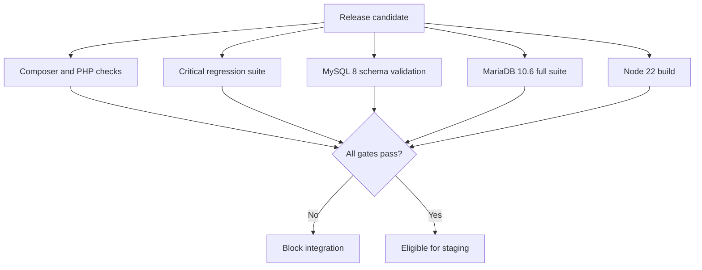

# Testing and CI

## Testing philosophy

The upgrade was governed by business-contract tests, not only framework bootstrap checks. A successful dependency install did not prove that payment callbacks, stock reservations, guest notifications, legacy fixtures, or cached configuration behaved correctly.

## Final quality gates

- Critical payment and stock suite: **55 tests, 372 assertions**
- Full representative suite: **209 tests, 1,101 assertions**
- PHP syntax validation: **149 files**
- Registered routes: **70**
- MySQL 8 representative schema: passed
- MariaDB 10.6 full suite: passed
- Composer validation and platform checks: passed
- Package discovery and application bootstrap: passed
- Config, route, and view cache generation: passed
- Node 22 frozen install and production build: passed

## CI matrix

## Failures the strategy exposed

- Legacy fixtures inserting modern timestamps into legacy string columns
- Payment callback tests missing real stock reservations
- Tests expecting a shadowed historical route instead of the effective secure route
- Laravel 12 parsing JSON-LD `@context` as a Blade directive
- Direct environment access failing under cached configuration

## Test-integrity rule

No test was removed, skipped, excluded, or weakened merely to create a green upgrade result. Failures were classified as genuine regressions, framework compatibility issues, inaccurate historical expectations, fixture/schema drift, or environment-specific behavior.
