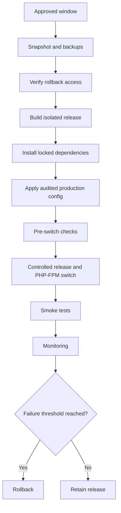

# Staging and Production Cutover

## Staging objectives

Staging validated the actual PHP 8.3 FPM runtime, required extensions, cached configuration, server rules, payment routes, frontend assets, and database reset procedure.

## Verified staging checkpoint

- Isolated PHP 8.3 FPM pool
- Protected access and read-only UAT controls
- GD and Redis extensions verified
- 113 locked Composer packages installed
- 149 PHP files passed syntax validation
- 70 routes registered
- 209 tests and 1,101 assertions passed
- Node.js 22 build passed
- COD, WebXPay, and KOKO flows exercised under controlled conditions
- Staging database returned to its clean baseline
- Homepage and health endpoint returned HTTP 200

## Production release sequence



## Deployment rule

Use:

```bash
composer install --no-dev --optimize-autoloader
```

Do not resolve a new dependency graph in production with `composer update`.

## Rollback triggers

- Application health failure
- Checkout unavailable
- Payment callback errors
- Stock transition failures
- Catalogue asset failures
- Authentication errors
- Worker/runtime mismatch
- Unexpected migration behavior
