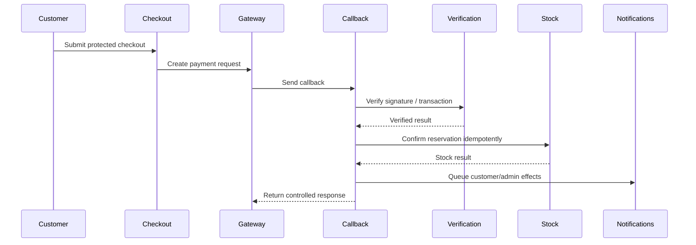
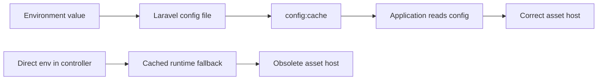

# Diagrams

## Modernization sequence

```mermaid
flowchart LR
    A[Laravel 10 / PHP 8.1] --> B[Reproducible CI baseline]
    B --> C[Laravel 11]
    C --> D[Representative legacy schema]
    D --> E[Laravel 12]
    E --> F[Laravel 13 / PHP 8.3]
    F --> G[Integrated release candidate]
    G --> H[Isolated staging]
    H --> I[Production cutover]
    I --> J[Monitoring]
    J --> K[Config-cache hotfix]
```

## Payment and stock protection

```mermaid
sequenceDiagram
    participant Customer
    participant Checkout
    participant Gateway
    participant Callback
    participant Verification
    participant Stock
    participant Notifications

    Customer->>Checkout: Submit protected checkout
    Checkout->>Gateway: Create payment request
    Gateway->>Callback: Send callback
    Callback->>Verification: Verify signature / transaction
    Verification-->>Callback: Verified result
    Callback->>Stock: Confirm reservation idempotently
    Stock-->>Callback: Stock result
    Callback->>Notifications: Queue customer/admin effects
    Callback-->>Gateway: Return controlled response
```

## Configuration-cache correction

```mermaid
flowchart LR
    A[Environment value] --> B[Laravel config file]
    B --> C[config:cache]
    C --> D[Application reads config]
    D --> E[Correct asset host]

    F[Direct env in controller] --> G[Cached runtime fallback]
    G --> H[Obsolete asset host]
```
